<div align="center">
  
  <!-- 动态打字效果 -->
  <a href="https://git.io/typing-svg"></a>

  <!-- 个性化徽章 -->
  <p>
    
    
    
  </p>

</div>

<div align="center">
  
</div>

## 🚀 关于我

```yaml
name: Zank
location: China
education: 
  - 专业: 计算机科学与技术
  - 年级: 大三
current_focus: Web开发 & 后端架构
hobbies: 
  - 钻研技术
  - 自主学习
  - 探索新知识
```


## 📊 统计数据

<div align="center">
  
  
</div>

<div align="center">
  
</div>

## 🌱 正在学习

```mermaid
mindmap
  root((技术图谱))
    后端开发
      Spring Boot
      Node.js
      数据库优化
    前端技术
      Vue.js
      现代化工具链
    DevOps
      Docker
      CI/CD
```

<div align="center">



</div>

## 💻 技术栈 

<div align="center">
  


</div>

## ⭐ 座右铭

<div align="center">
  
> *"纸上得来终觉浅，绝知此事要躬行。"*

</div>

<!-- 贡献图 -->
<div align="center">
  
</div>

---

<div align="center">
  
</div> 

## 📫 联系我

<div align="center">
  <a href="mailto:z3298232021@outlook.com">
    
  </a>
</div>
